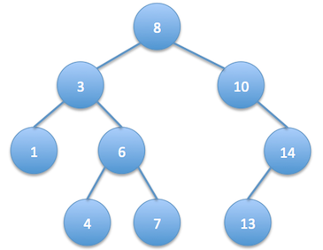
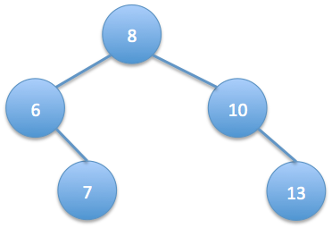

Given the root of a binary search tree and 2 numbers min and max, trim the tree such that all the numbers in the new tree are between min and max (inclusive). The resulting tree should still be a valid binary search tree. So, if we get this tree as input:

and we’re given min value as 5 and max value as 13, then the resulting binary search tree should be:

Example1
```
Input: 
{8,3,10,1,6,#,14,#,#,4,7,13}
5
13
Output: {8, 6, 10, #, 7, #, 13}
Explanation:
The picture of tree is in the description.
```
Example2
```
Input: 
{1,0,2}
1
2
Output: {1,#,2}
Explanation:
Input is 
  1
 / \
0   2
Output is
  1
   \
    2
```